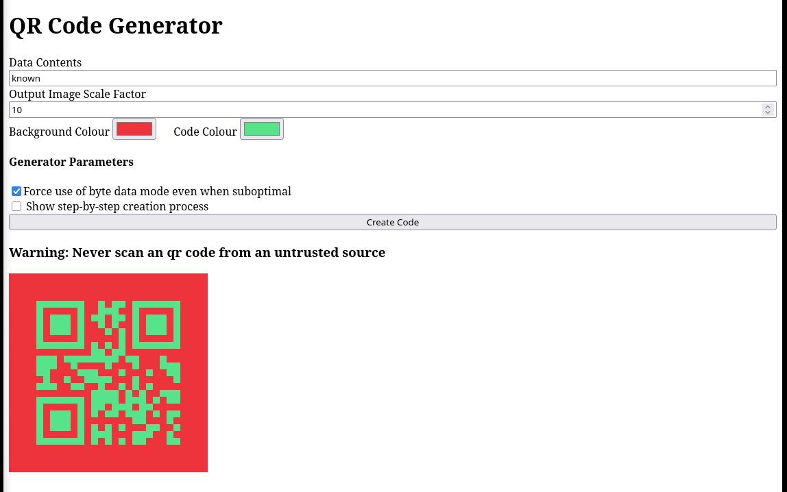
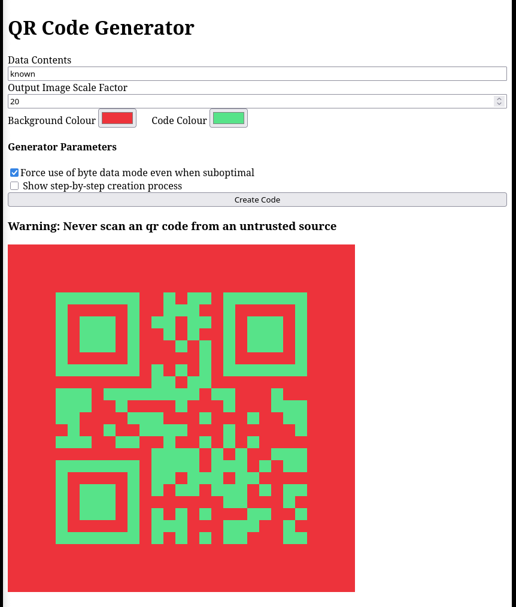
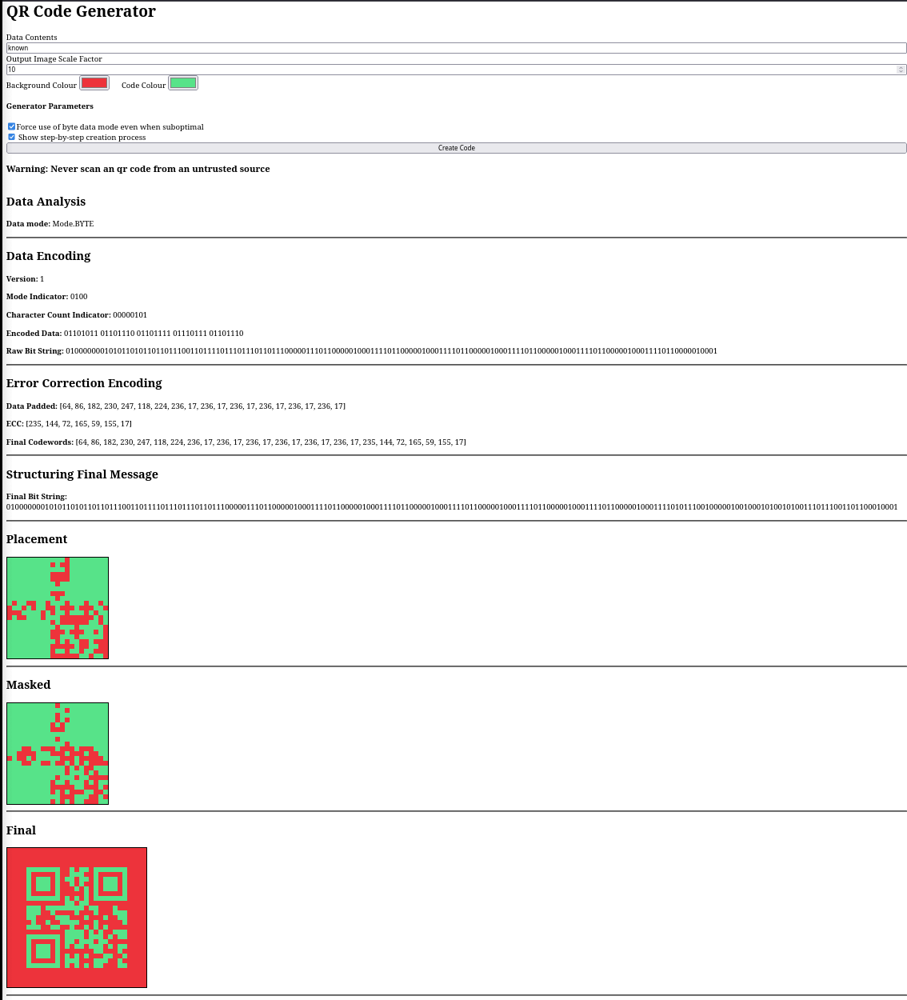

# QR Code Generator

> **USER WARNING: NEVER SCAN A QR CODE FROM AN UNTRUSTED SOURCE.**

This application was created with guidance from [Thonky's QR Code Tutorial](https://www.thonky.com/qr-code-tutorial/).

## Description of Functionality

This application creates a QR code from arbitrary user input and is capable of generating Version 1 and Version 2 QR codes.

Input data is converted into byte-mode data and encoded into a bitstream containing mode indicators and a character count.

Reed-Solomon error correction codewords are generated at one of four levels:

- Low (L)
- Medium (M)
- Quartile (Q)
- High (H)

The error correction codewords are appended to the encoded data before the complete bitstream is structured and mapped into the QR code matrix.

The QR matrix is constructed with the required structural components, including:

- Finder patterns
- Separators
- Alignment patterns
- Timing patterns
- Reserved areas for format information
- The dark module

Masking patterns are then applied to the QR matrix to reduce large areas of a single colour and improve the readability of the QR code by scanners.

Format information is generated containing the selected error correction level and masking pattern. This information is then placed within the matrix to assist QR code decoding.

The completed QR code is converted into an image and displayed below the user input field.

## My Contributions

This was a collaborative group project. My primary contributions focused on the QR matrix construction and formatting stages of the generation pipeline.

I contributed to the implementation of:

- **QR Matrix Placement** – Implemented the placement of finder patterns, separators, alignment patterns, timing patterns, reserved format-information areas and the dark module within the QR matrix.
- **Format Information** – Implemented the generation and placement of QR format information, including error-correction level and masking pattern data.
- **Testing** – Developed and contributed to automated tests for the QR placement and formatting components.
- **Integration** – Integrated all components with the wider QR generation pipeline using Git-based version control.

## Installation

**Supported operating systems:** Windows and Linux

### Windows

Install Python using Windows Package Manager:

```bash
winget install python3


# Programming techniques:
With the workload split between each group member, the code produced individually has a multitude of programming techniques seen throughout.

Imperative programming, the step by step execution of commands is clearly put to use inside of placement.py with 'populate_matrix()', calling multiple
functions to place patterns such as finders, aligners and separators into the matrix one at a time; this technique is also evidenced in the building
of the entire QR code object, with each section of thonky's QR guide performed before the next step ensues. The benefit to the use of imperative 
programming is in having control over each process within generation to ease in debugging and managing the flow of components in a logical order.

Object-Oriented Programming is also used for QR generation with passing information between the python files, which is necessary as each section of 
code requires the output of the file prior. To safely do this without having to pass data with parameters and returns, the QR was modelled as a
class, with each step stored as an attribute of it. This method allows previously used elements to be easily referenced, such as needing the QR code 
version and masking pattern when creating the format information string.

Functional programming is used throughout also, namely within the analysis.py file with functions like 'is_kanji()' to isolate specific tasks, returning 
the same output each time the same input is received; this predictibility is essential when creating the data stream to be placed into the qr code matrix 
as each user input must be decoded when scanned. Its also important to perform tasks modularly for testing as the objects state can be compared to an 
expected state at multiple checkpoints during runtime.

Multiple programming methods are included within the QR code application to promote clarity and modularity for a robust final product, which performs
reliably under extraneous conditions.


# Ethical Considerations:
Many legal, social and ethical considerations were taken when creating this QR code application.

Accessibility and inclusivity were central to development with support for the kanji character set which cators for an audience broader
broader then those who use Latin alphabet. Additionally, users can customise the QR code image to use different sizes for users who wish 
to use the generated QR codes whom may have troubles with eye sight, or perhaps allows users with order/lower quality cameras to still use
the application. This ensures the qr code maker can be used by a wide range of people.

Data protection is central to all applications as stated by the UK Data Protection Act of 2018. The QR code generator was developed without
the need to collect, send or save any personal data as no account is required within the QR code application; as a result, the user can not 
unintentionally enter personal information to the QR code. Ontop of this, a warning to never scan a non-trusted QR code is placed before the
instructions to warn users of the risks of scanning codes of potentially malicious users.

The QR code is generated step-by-step with tracable method as shown with the screen-capture animation of the application runnning. The project
is open-source to those with access to the repository meaning there is high transparency for users as to how the code functions; this aids in 
developing trust for users such that they can verify the code or improve it independently to their liking. Error correction and masking is used
to improve the reliability of scanning the QR codes that are generated which is important if being used for business purposes as well as making
it readible with the majority of QR scanners, largely aided by the use of ISO/IEC 18004 standards.


# Weaknesses & Action Taken:
Though the generator was made with user safety in mind, weaknesses and misuse are difficult to minimise inside the application:

One concern with QR codes is that they are highly unreadible for humans in that there is no letters or numbers to indicate the destination once the 
QR code is scanned. Even though the user is safe when using the application due to its simplicity and lack of need for an account with personal information,
QR codes generated with the application could potentially lead to harmful or malicious websites. As mitigation to this, warnings are placed at the top of 
the README file to educate users on the associated risks with QR codes and thier generation.

As for error handling, checks are made through out the code to make sure functions revieve expected data. One such test is seen in analysis.py where it 
must be confirmed that the user input is alphanumerical or in Kanji, this is imperative as encoding will not work on unexpected characters. Each file has 
testing performed on it upon commiting to the main branch to confirm that functions create expected outputs when given known inputs, this isolated testing
of each feature make the application far more reliable and stable.

The application a virtual or isolated shell environmen,dependant on windows or linux set up, for increased security. This seprates dependencies from the
systems own packages which prevents conflicts and changes being made to the users own computer.

# Real World Applications:
As a result of following Thonky's guide which uses the Denso-Wave QR code format, the QR codes generated by this application are scannable by all QR
code scanners with correctly placed format strings incidicating the masking pattern used and error correction level which makes the QR code more easily readible
to all scanners and even cameras of poorer quality. As such, the application for the
generated QR codes is vast.

For example, a business can create a QR code linking to their social media pages, websites or product pages. The option to colour the QR code to match branding so 
that the QR code looks consistent and professionally placed on brand materials. QR codes could also have application in inventory management with QR codes being
placed on product packaging and scanned to see stock levels.

Another use could be in education, with the QR code linking to work sheets and assignments or to track student attendence, as is done at the University of Reading.

What makes this QR code generation application suited for these environments is the ease of use when generating the QR codes, with it being an input box with a 
couple of extra options with preferences for the output. The wide support for QR codes in modern devices, such as a scanner being built into camera apps on the 
majority of mobile device operating systems, is what makes them such a popular choice for directing people to digital content.

# Accessiblity
There is a size scale input and a colour inputs to make the code larger and a different colour. This could help individuals with visual disabilies/difficulties. see:  and 

# Additional features
The mask is optimally selected but this is difficult to visualise.
There is as step by step display of the code creation process when the checkbox is selected, see 


